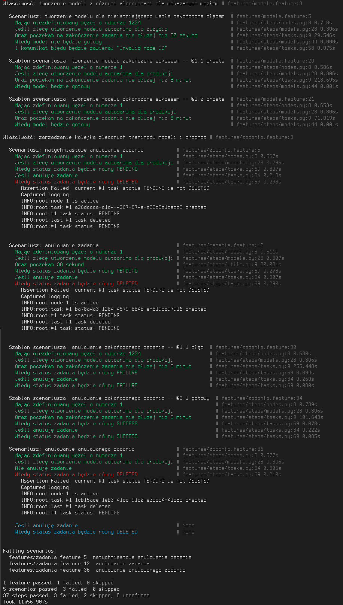

# Behave tests for ML API

## Documentation

<https://behave.readthedocs.io/>

## How to run

1. Install behave and WebTest using
   `apt install python3-behave python3-webtest python3-wsgiproxy`
   or `pip install behave WebTest WSGIProxy2`
2. Create SSH tunnel for ML API at <http://localhost:8000/api>
3. Run `behave` from this dir, append `--logging-level=debug --no-logcapture`
   to see detailed messages during tests.

Some test scenarios can be skipped if task queue has more then 10 pending+started
tasks (condition forced in test scenarios).

